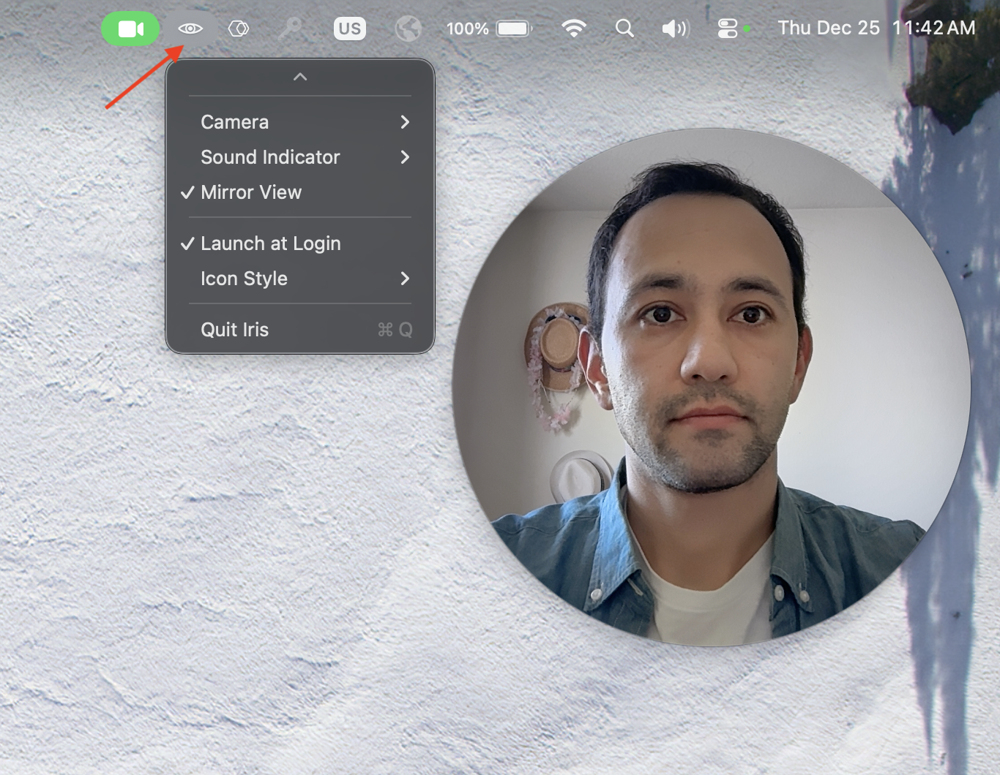

# Iris.app

Iris is a macOS application that displays your webcam feed in a circular,
always-on-top window. It's a replacement for **Pearl** or **Hand Mirror** apps.

<center>

</center>

The project is entirely coded by an LLM agent. See [AGENTS.md](AGENTS.md) for development
principles and [design/](design/) for feature specifications.

## Features

* **Menu Bar Only** - Lives in the menu bar, doesn't occupy the Dock
* **Always On Top** - Window stays above other applications
* **Circular Window** - Perfectly circular shape with smooth edges
* **Resizable** - Drag from the edges of the circle to resize
* **Toggle Visibility** - Click menu bar icon to show/hide window
* **Camera Selection** - Choose from multiple camera sources
* **Launch at Login** - Optionally, start on system login
* **Persistent State** - Remembers size, position, and camera selection
* **Sound Indicator** - Visual indicator around the mirror view to show when
  microphone is picking up sound
* **Mirror View** - Toggle between mirrored view (like looking in a mirror, default)
  and non-mirrored view (how others see you)

## Installation

### Homebrew (Recommended)

Install via Homebrew using the custom tap (you'll receive version updates
automatically if you install it via Homebrew):

```bash
brew tap ahmetb/iris https://github.com/ahmetb/Iris
brew install --cask ahmetb/iris/iris
```

⚠️ **macOS will show a warning about the unsigned application binary**. This is normal for open-source apps distributed outside the Mac App Store. To solve this:

1. **First launch**: Right-click (or Control-click) on Iris.app and select "Open"
2. Click "Open" in the security dialog.
3. If this doesn't fix your problem, go to `System Settings` search for `Gatekeeper` (which should be under "Privacy & Security" section) and you can see an option to allow "Iris" app to run there under the "Security" section.

### Manual Download

1. Download the latest `Iris-vX.X.X.zip` from the [Releases](../../releases) page
2. Unzip the file
3. Move `Iris.app` to your Applications folder
4. ⚠️ **macOS will show a warning about the unsigned application binary**. This
   is normal for open-source apps distributed outside the Mac App Store. To solve
   this:

   1. **First launch**: Right-click (or Control-click) on Iris.app and select "Open"
   2. Click "Open" in the security dialog.
   3. If this doesn't fix your problem, go to `System Settings` search for
   `Gatekeeper` (which should be under "Privacy & Security" section) and you can
   see an option to allow "Iris" app to run there under the "Security" section.

### Build from Source

#### Requirements

* macOS 13.0 or later
* **Full Xcode installation** (not just Command Line Tools)
  - Download from the [Mac App Store](https://apps.apple.com/app/xcode/id497799835)
  - Command Line Tools alone are not sufficient for building macOS apps

## Building

### First Time Setup

1. Install Xcode from the Mac App Store
2. Open Xcode and agree to the license agreement
3. Set the command line tools path:

   ```bash
   sudo xcode-select --switch /Applications/Xcode.app/Contents/Developer
   ```

### Build Commands

```bash
./build.sh # Build the app
./run.sh # Build and run
./clean.sh # Clean build artifacts
```

The built application will be located at `Iris/build/Release/Iris.app`.

## Usage

1. Launch the app using `./run.sh` or by opening `Iris.app`
2. Grant camera permissions when prompted
3. The app icon will appear in your menu bar (top right)
4. Click the icon to toggle the window visibility
5. Right-click the icon (or click and hold) to access:
   - Camera selection
   - Sound Indicator settings
   - Mirror View toggle
   - Launch at login setting
   - Quit option

### Interacting with the Window

* **Move**: Click and drag anywhere inside the circle
* **Resize**: Click and drag from the edge of the circle
* **Hide**: Click the menu bar icon

### Sound Indicator

When the microphone is picking up sound, a visual indicator will appear around
the mirror view. This feature is disabled by default.

## Camera Permissions

On first launch, macOS will prompt you to grant camera access. If you deny permission:

1. Open System Settings
2. Go to Privacy & Security > Camera
3. Enable camera access for Iris

## Development

This is an LLM-agent-coded project. See [AGENTS.md](AGENTS.md) for development
principles and [design/](design/) for feature specifications.

### Project Structure

```
iris/
├── AGENTS.md                 # Development principles
├── README.md                 # This file
├── RELEASING.md              # Release process documentation
├── design/                   # Feature design documents
├── Casks/                    # Homebrew cask formula
│   └── iris.rb
├── .github/
│   └── workflows/
│       └── release.yml       # GitHub Actions release workflow
├── Iris/                     # Xcode project
│   ├── Iris.xcodeproj
│   ├── Iris/                 # Source code
│   │   ├── AppDelegate.swift
│   │   ├── CameraManager.swift
│   │   ├── CircularWindow.swift
│   │   ├── MenuBarController.swift
│   │   └── PreferencesManager.swift
│   └── Iris.entitlements
├── build.sh                  # Build script
├── run.sh                    # Run script
└── clean.sh                  # Clean script
```

## Creating a Release

See [RELEASING.md](RELEASING.md) for detailed release instructions.

Quick version:
```bash
# Tag the release
git tag v1.0.0

# Push the tag to GitHub
git push origin v1.0.0
```

GitHub Actions will automatically:
- Build the app on a macOS runner
- Create a zip archive
- Update the Homebrew cask with new version and SHA256
- Publish a GitHub Release with the zip attached

## Troubleshooting

### "xcodebuild requires Xcode" error
Install full Xcode from the App Store, not just Command Line Tools.

### App doesn't appear in menu bar
The app is menu-bar-only (no Dock icon). Look for the eye icon (👁) in the top-right menu bar.

### Camera not working
Check System Settings > Privacy & Security > Camera and ensure Iris has permission.

### Window disappeared
Click the menu bar icon to show it again. The app remembers window position between launches.

## License

This project is open source and available for personal and commercial use.
